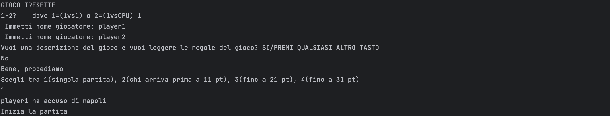
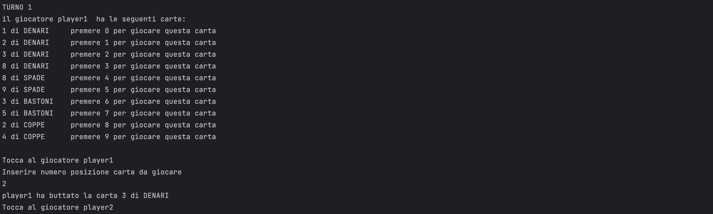

# tressette

A Java program to play the Tressette card game.
 
#### Built With
[![Java][Java.js]][Java-url]

## Table of Contents
- [Description](#description)
- [Prerequisites](#prerequisites)
- [Installation](#installation)
- [Usage](#usage)
- [UML Diagram](#uml-diagram)
- [Execution Example](#execution-examples)

## Description

This Java program allows you to play the classic Italian card game called Tressette. It provides a command-line interface where you can play against the computer or against other human players.

## Prerequisites

- Java JDK 8 or higher installed on your machine

## Installation
1. Clone the repository:
   ```bash
   git clone https://github.com/cavallo5/tressette.git
   ```
2. Compile the Java source files:
   ```bash
   javac src/*.java -d output
   ```
   
## Usage
1. Start the game by running the compiled Java file:
    ```bash
    java -cp output src/JTressette.java 
    ```
2. Follow the on-screen instructions to play the game.
3. Enjoy!

## UML Diagram
[UML Diagram][UML-diagram]

## Execution Examples



<!-- MARKDOWN LINKS & IMAGES -->
[Java.js]: https://img.shields.io/badge/Java-ED8B00?style=for-the-badge&logo=openjdk&logoColor=white
[Java-url]: https://www.java.com
[UML-diagram]: doc/uml.png
[UML2-diagram]: doc/umlResponse.png
[Exec1]: doc/exec1.png
[Exec2]: doc/exec2.png
